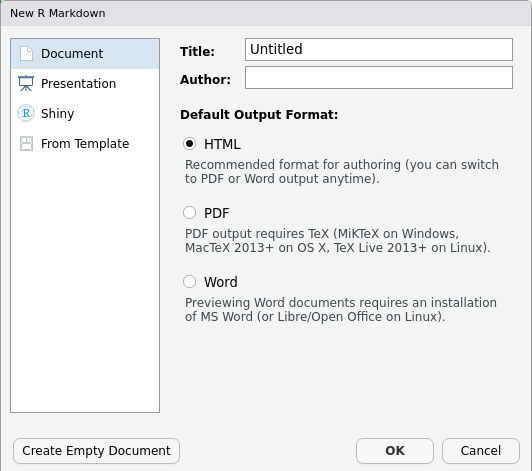

---
# Please do not edit this file directly; it is auto generated.
# Instead, please edit 06-rmarkdown.md in _episodes_rmd/
title: "Getting started with R Markdown"
teaching: 30
exercises: 15
output: 
  html_document:
    df_print: paged
objectives:
- Create a .Rmd document containing R code, text, and plots
- Create a YAML header to control output
- Understand basic syntax of (R)Markdown
- Customise code chunks to control formatting
- Use code chunks and inline code to create dynamic documents
- Understand how R Markdown can be used to create reproducible reports
keypoints: R Markdown is a popular language for creating reproducible reports, articles, and theses.
source: Rmd
questions:
- What is R Markdown?
- How can I integrate my R code with text and plots?
- How can I convert .Rmd files to .html, .pdf, and .docx?
---


## R Markdown

R Markdown is a flexible type of document that allows you to seamlessly combine 
R-code and text in a single document. These documents can be readily ... , including
PDF (.pdf), Word (.docx), and HTML (.html).

The benefit of a well-prepared R Markdown document is full reproducibility. This
also means that, if you notice a data transcription error, or you are able to add 
more data to your analysis, you will be able to recompile the report with the new
data, without making any changes in the actual document.

It relies on the **rmarkdown** package.

## Creating an R Markdown file

To create a new R Markdown document in RStudio, click File -> New File -> R Markdown:



Then click on 'Create Empty Document'. Normally you could enter the title of your
document, your name (Author), and select the type of output, but we will be learning
how to start from a blank document.

## Basic components of R Markdown

To control the output, a YAML (originally, Yet Another Markup Language; now, YAML Ain't Markup Language)
header is needed.

```
---
title: "My Awesome Report"
author: "My Awesome Name"
date: ""
output: html_document
---
```

The only necessary field is the `output:`, which specifies the type of output you
want. The rest can be deleted if you don't need them. To start the document, 
we will begin writing below the YAML header (i.e. after the second `---`).

## Markdown syntax

Markdown is ...

First, let's create a header:

```
# Title
## Section
### Sub-section
#### Sub-sub section
##### Sub-sub-sub section
```

Since we have already defined our title in the YAML header, we will use a section
header.

```
## A meaningful header

Some meaningful text to go along with my meaningful header.
```

You can make things **bold** by surrounding the word with double asterisks, 
`**bold**`, or double underscores, `__bold__`; and *italicize* using single asterisks,
`*italics*`, or single underscores, `_italics_`.

You can also combine **bold** and *italics* to write something ***really*** 
important with triple-asterisks, `***really***`, or underscores, `___really___`;
and, if you're feeling bold (pun intended), you can also use a combination of
asterisks and underscores, **_really_**. Just be consistent...

To create `code-type` font, surround the word with backticks.

Now that we've learned a couple of things, it might be useful to create a list so
we don't forget:

```
- bold with double-asterisks
- italics with underscores
- code-type font with backticks
```

You can also create an ordered list using numbers:

```
1. bold with double-asterisks
2. italics with underscores
3. code-type font with backticks
```

And nested items by tab-indenting:

```
- bold with double-asterisks
  + or double-underscores
- italics with underscores
  + or double-asterisks
- bold and italics with triple-asterisks
  + or triple-underscores
    - or a combination of both
- code-type font with backticks
```

Now we can Knit the document into HTML by clicking the 'Knit' button in the top
of the Source pane (top left), or use the keyboard shortcut
<kbd>Ctrl</kbd>+<kbd>Shift</kbd>+<kbd>K</kbd> on Windows and Linux, or 
<kbd>Cmd</kbd>+<kbd>Shift</kbd>+<kbd>K</kbd> on Mac.

For more Markdown syntax see [here](https://www.markdownguide.org/basic-syntax).

The new visual Markdown editor in RStudio (from version 1.4) may make this easier
for you...

> ## Challenge 1
>
> Create a new blank R Markdown document and write a bit of Markdown 
>(some sections, some italicized text, and an itemized list).
>
> Convert the document to a webpage.
> > ## Solution to Challenge 1
> >
> > In RStudio, select File > New file > R Markdown... 
> > 
> > Add the following:
> > 
> > ```
> > # Introduction
> > 
> > ## Background on Data
> > 
> > This report uses the *SAFI* dataset, which has columns that include:
> > 
> > * village
> > * interview_date
> > * no_members
> > * years_liv
> > * respondent_wall_type
> > * rooms
> > 
> > ## Background on Methods
> > 
> > ```
> > 
> > Then click the 'Knit' button on the toolbar to generate an html document.
> {: .solution}
{: .challenge}

## Writing an R Markdown report

We will be writing a report based on our previous data wrangling and visualisation,
which means we need to make sure **tidyverse** is loaded. It is not enough to
load **tidyverse** from the console, we will need to load it within our Rmd
document. For that, we will need to create a 'code chunk' at the top of our document
(under the YAML header). The syntax of a code chunk is:

<pre>
&#96;&#96;&#96;{r chunk_name}
R code here
&#96;&#96;&#96;
</pre>

That is, between ```{r chunk_name} and ```, you place the R code you want to run.
Naming a chunk is optional, but recommended. Each chunk name must be unique, and
only contain numbers, `-`, and `_`.

The keyboard shortcut for inserting a code chunk in RStudio is
<kbd>Ctrl</kbd>+<kbd>Alt</kbd>+<kbd>I</kbd> on Windows and Linux, or
<kbd>Cmd</kbd>+<kbd>Option</kbd>+<kbd>I</kbd> on Mac.

To load **tidyverse**, we will insert a chunk and call it 'setup'. Since we don't
won't to show the chunk or the output of the chunk, so
we use: `{r setup, include=FALSE}`. More on chunk options later.


~~~
library(tidyverse)
~~~
{: .language-r}

We will also need the data we worked with earlier. If not still in the workspace,
load the data we saved in the previous lesson:


~~~
interviews <- read_csv("data/SAFI_clean.csv", na = "NULL")
~~~
{: .language-r}

First we will write a short introduction under a section-heading that we will call
'Introduction'.

### Insert table

Next, we will create a table with the first 10 entries and first 6 columns in the
interviews data frame.


### Customising chunk output

There are multiple options available to customise how the code-chunks are presented
in the output document.

| Option | Output |
|---|---|
| `eval=<TRUE,FALSE>` | Whether or not the code within the code chunk should be run. |
| `echo=<TRUE,FALSE>` | Choose if you want to show your code chunk in the output document. `echo=TRUE` will show the code chunk. |
| `include=<TRUE,FALSE>` | Choose if the output of a code chunk should be included in the document. `FALSE` means that your code will run, but will not show up in the document. |

The options are entered in the code chunk after `chunk_name` and separated by
commas, e.g. `{r} chunk_name, eval=FALSE, echo=TRUE`.

The default settings are: `eval=TRUE`, `echo=TRUE`, `include=TRUE`.
The default settings can be modified with `knitr::opts_chunk$set()`.

> ## Challenge 2
>
> Play around with the different options in the chunk with the code for the table, 
> and re-Knit to see what each option does to the output.
>
> What happens if you use `eval=FALSE` and `echo=FALSE`? What is the difference between
> this and `include=FALSE`? 
> > ## Solution to Challenge 2
> > 
> > Create a chunk with `{r} eval=FALSE, echo=FALSE`, then create another chunk
> > with `{r} include=FALSE` to compare.
> > `eval=FALSE` and `echo=FALSE` will neither run the code in the chunk, nor show 
> > the code in the knitted document. The code chunk essentially doesn't exist in
> > the knitted document, 
> > whereas `include=FALSE` will run the code and store the output for later use.
> {: .solution}
{: .challenge}


<!-- Insert table with caption using `knitr::kable`. -->

### In-line R code

Then we will use some in-line R code to talk about some of the descriptive statistics.
To use in-line R-code, we can use the backticks again, but we also need to specify
that we are using R-code, by including `r` after the first backtick: 

This  is surrounded by meaningful text.

By including in-text R-code to present descriptive statistics (or test statistics),
it will be run each time we knit the document. Which means if, for whatever reason,
our data have changed, the document will automatically update the descriptive statistics
accordingly. Pretty useful for those of us who are prone to data entry errors!

### Plots

Next we will also include a plot, so our document is a little more colourful, and
a little less boring.

If you were unable to complete the previous lesson or did not save the data,
then you can create it now.


~~~
## Not run, but can be used to load in data from previous lesson!
interviews_plotting <- interviews %>%
  ## pivot wider by items_owned
  separate_rows(items_owned, sep = ";") %>%
  ## if there were no items listed, changing NA to no_listed_items
  replace_na(list(items_owned = "no_listed_items")) %>%
  mutate(items_owned_logical = TRUE) %>%
  pivot_wider(names_from = items_owned, 
              values_from = items_owned_logical, 
              values_fill = list(items_owned_logical = FALSE)) %>%
  ## pivot wider by months_lack_food
  separate_rows(months_lack_food, sep = ";") %>%
  mutate(months_lack_food_logical = TRUE) %>%
  pivot_wider(names_from = months_lack_food, 
              values_from = months_lack_food_logical, 
              values_fill = list(months_lack_food_logical = FALSE)) %>%
  ## add some summary columns
  mutate(number_months_lack_food = rowSums(select(., Jan:May))) %>%
  mutate(number_items = rowSums(select(., bicycle:car)))
~~~
{: .language-r}


<!-- Exercise: Create a code chunk with code to output a plot. -->

## Other cool things R Markdown can do

Websites with the **blogdown** package

Books with the **bookdown** package

Slides with the **xaringan** package

Article templates with the **rticles** package

## Resources

* [Knitr in a knutshell tutorial](http://kbroman.org/knitr_knutshell)
* [Dynamic Documents with R and knitr](http://www.amazon.com/exec/obidos/ASIN/1482203537/7210-20) (book)
* [R Markdown documentation](http://rmarkdown.rstudio.com)
* [R Markdown cheat sheet](https://www.rstudio.com/wp-content/uploads/2016/03/rmarkdown-cheatsheet-2.0.pdf)
* [Getting started with R Markdown](https://www.rstudio.com/resources/webinars/getting-started-with-r-markdown/)
* [R Markdown: The Definitive Guide](https://bookdown.org/yihui/rmarkdown/) (book by Rstudio team)
* [Reproducible Reporting](https://www.rstudio.com/resources/webinars/reproducible-reporting/)
* [The Ecosystem of R Markdown](https://www.rstudio.com/resources/webinars/the-ecosystem-of-r-markdown/)
* [Introducing Bookdown](https://www.rstudio.com/resources/webinars/introducing-bookdown/)
